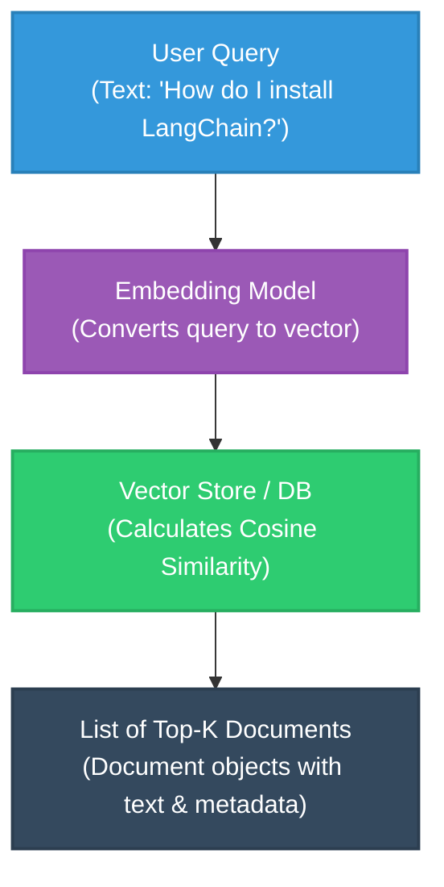
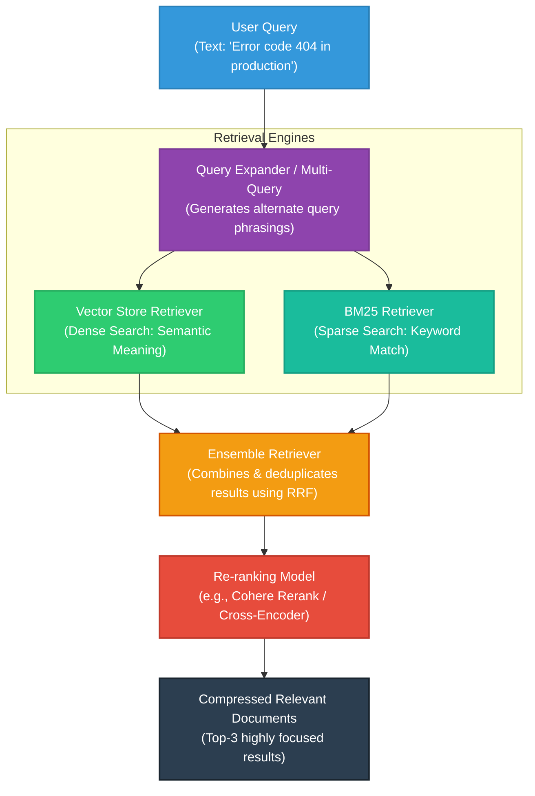

# LangChain Retrievers: Core Architecture & Implementation Notes

In Retrieval-Augmented Generation (RAG), a **Retriever** is a crucial component that fetches relevant documents from a dataset to serve as background context for a Large Language Model (LLM). 

---

## 1. Retrievers in Simple Words

### What is a Retriever?
Imagine you are sitting in an exam hall and need to write an essay on *"The History of Laser Propulsion"*. 
- The exam paper is the **user query**.
- You are the **LLM**.
- Since you can't memorize everything, you have a **smart research assistant** who runs to the library, finds the top 4 most relevant book chapters, highlights the key sentences, and hands them to you.
- That research assistant is the **Retriever**.

A Retriever is a component that takes a simple text string (the query) and returns a list of matching `Document` objects (each containing text and metadata). 

> [!NOTE]
> Unlike a Vector Database, a Retriever does not *need* to store data or compute mathematical embeddings itself. It is a high-level search interface wrapper: **Input (Query) ──► Output (List of Documents)**.

---

## 2. Why, What, and How

### Why do we need Retrievers?
1. **Context Window Limits**: LLMs have a maximum amount of text they can process in a single prompt. You cannot feed an entire database or a 500-page manual to an LLM.
2. **Hallucination Prevention**: LLMs tend to make up facts when they lack accurate, domain-specific information. Giving them verified reference documents anchors their answers in truth.
3. **Cost & Latency Reduction**: Processing thousands of irrelevant words costs more money (token usage) and takes longer. Retrievers filter out the noise.

### What is it programmatically?
In LangChain, a retriever is a standard Runnable class (`BaseRetriever`) that conforms to a simple protocol. It implements:
- `get_relevant_documents(query: str) -> List[Document]` (Legacy synchronous call)
- `invoke(input: str) -> List[Document]` (Modern runnable call)

### How does it work?
1. A user asks a question.
2. The Retriever receives the question.
3. The Retriever queries a backing system (which could be a Vector DB, a SQL database, a keyword index, or a Web Search API).
4. The Retriever performs post-processing on the results (like re-ranking, deduplication, or filtering).
5. It returns the documents directly to your application or LLM chain.

---

## 3. The Core Idea & Philosophy

The foundational idea behind LangChain's retriever abstraction is the **Decoupling of Storage from Retrieval**.

```
┌───────────────────────────────┐          ┌───────────────────────────────┐
│     STORAGE / INDEXING        │          │     RETRIEVAL / SEARCH        │
│  (How data is saved & structured)│   VS.    │  (How data is found & processed) │
│  - Chunk size & overlap       │          │  - Query translation          │
│  - Embedding models           │          │  - Multi-source ensemble      │
│  - DB Indexes (HNSW, Flat)    │          │  - Reranking & compression    │
└───────────────────────────────┘          └───────────────────────────────┘
```

A **Vector Store** is just a database index. Wrapping it in a **Retriever** lets you apply advanced algorithms on top of the search query without rewriting how the vectors are stored in the database.

---

## 4. Visual Block Diagrams (Colored)

### A. Basic Vector Store Retrieval Flow
This is the simplest form of retrieval: convert the query to an embedding and fetch the closest vectors.



---

### B. Advanced Hybrid & Re-ranked Retrieval Flow
Modern RAG systems combine multiple search techniques and use re-ranking models (cross-encoders) to sort findings before sending them to the LLM.



---

## 5. Types of Retrievers (From Basic to Advanced)

Here is a summary matrix of the most common retriever types in LangChain:

| Retriever Type | How it Works | Best Used For | Pros | Cons |
| :--- | :--- | :--- | :--- | :--- |
| **Vector Store** | Matches vector similarity (e.g. Cosine). | Semantic, conceptual questions. | Understands synonyms. | Misses exact keywords (e.g., product IDs). |
| **BM25 (Lexical)** | Counts word frequency and match relevance. | Specific keywords, error codes, IDs. | Extremely fast, precise. | Fails on synonyms or conceptual phrases. |
| **Ensemble (Hybrid)** | Blends BM25 and Vector Search using RRF. | General-purpose high-quality RAG. | Best of both worlds. | Slower (runs two queries). |
| **Multi-Query** | Generates multiple queries with LLM, runs all. | Vague, poorly written user queries. | Overcomes bad phrasing. | High LLM cost and slower speed. |
| **Self-Querying** | LLM extracts semantic terms AND metadata filters. | Queries on structured + unstructured data. | Avoids searching entire DB. | Requires clear metadata schema. |
| **Parent Document** | Searches small chunks, returns parent document. | Deep search with wide-context generation. | Context is not lost. | Uses more token space. |
| **Context Compression**| Retains only sentences matching query intent. | Reducing prompt sizes and costs. | Minimal token usage. | Adds latency due to filtering step. |
| **Re-ranker** | Re-sorts retrieved docs using Cross-Encoders. | Improving accuracy of retrieved ranks. | Drastically increases accuracy. | Requires secondary API/Model call. |

---

### Detailed Breakdown

#### 1. Vector Store Retriever
The baseline model. It acts as a client wrapper around any vector database (Chroma, Pinecone, FAISS).
- **Core Setting**: Search types can be `"similarity"`, `"mmr"` (Maximal Marginal Relevance to diversify results), or `"similarity_score_threshold"`.

#### 2. BM25 (Sparse Vector / Lexical Search)
BM25 is a classic information retrieval algorithm. It does not use machine learning embeddings. It acts strictly on TF-IDF (Term Frequency-Inverse Document Frequency) principles.
- **Example**: Searching for `"CVE-2023-3456"` is highly effective here because it looks for the exact alphanumeric string, whereas an embedding model might see it as just "another security number."

#### 3. Ensemble Retriever (Hybrid Search)
This combines different retrieval methods. The most common configuration matches a dense vector search retriever with a sparse BM25 keyword retriever.
- It uses **Reciprocal Rank Fusion (RRF)**, a mathematical formula to combine the rank positions of documents from both methods and produce a unified, sorted output list.

#### 4. Multi-Query Retriever
Users often formulate queries in sub-optimal ways (e.g. *"Python tool for files"* instead of *"How to read CSVs in LangChain"*).
- The Multi-Query Retriever uses an LLM to generate 3-5 alternative variations of the query.
- It runs retrieval on all generated variations.
- It returns the union of all retrieved documents to capture the widest possible set of context.

#### 5. Self-Querying Retriever
If a user asks *"Show me romantic comedies made after 2010 that are under 2 hours"*, a standard vector search might fail because "after 2010" and "under 2 hours" are mathematical comparisons, not conceptual topics.
- A Self-Querying Retriever uses an LLM to parse the query into:
  1. A semantic query: `"romantic comedy"`
  2. A metadata filter: `{"year": {"$gt": 2010}, "runtime": {"$lt": 120}}`
- It then queries the Vector DB applying the filter directly, saving compute power.

#### 6. Parent Document Retriever
During indexing, we split documents into small chunks (e.g., 200 characters) so that embeddings are highly specific. However, if we only feed a tiny 200-character chunk to the LLM, the LLM might lose the bigger picture (context).
- The Parent Document Retriever addresses this by storing small chunks in the Vector DB for matching, but linking them to larger "parent" documents (or the original text) stored in an in-memory document store.
- When a small chunk is matched, the retriever returns the entire parent document to the LLM.

#### 7. Contextual Compression & Re-ranking (e.g. Cohere / Cross-Encoders)
A standard retriever might fetch 10 documents, each containing 500 words. Most of those words are filler text irrelevant to the query.
- **Contextual Compression**: Iterates over retrieved documents and uses a helper model to extract only the sentences containing answers to the query.
- **Re-ranking**: Vector similarity is fast but approximate. Cross-encoder models (like Cohere Rerank) are slow but incredibly accurate at determining if document B actually answers query A. Re-ranking runs a second-stage sort to make sure the best documents are at the very top of the pile.

---

## 6. Basic Python Code Snippets

Here is how you initialize and call common retrievers in LangChain:

### Basic Vector Store Retriever
```python
# Wrap an existing vectorstore
retriever = vectorstore.as_retriever(
    search_type="similarity",
    search_kwargs={"k": 4} # Retrieve top 4 documents
)

# Invoke the retriever
docs = retriever.invoke("How do I implement custom retrievers?")
```

### Ensemble (Hybrid) Retriever
```python
from langchain.retrievers import EnsembleRetriever
from langchain_community.retrievers import BM25Retriever

# 1. Initialize BM25 Lexical Retriever
bm25_retriever = BM25Retriever.from_texts(texts)
bm25_retriever.k = 2

# 2. Initialize Vector Store Retriever
vector_retriever = vectorstore.as_retriever(search_kwargs={"k": 2})

# 3. Create Ensemble Retriever (RRF weighted)
ensemble_retriever = EnsembleRetriever(
    retrievers=[bm25_retriever, vector_retriever],
    weights=[0.5, 0.5] # Balance lexical and semantic search equally
)

docs = ensemble_retriever.invoke("LangChain agents")
```

### Cohere Re-ranker with Contextual Compression
```python
from langchain.retrievers import ContextualCompressionRetriever
from langchain_cohere import CohereRerank

# Initialize base vector retriever
base_retriever = vectorstore.as_retriever(search_kwargs={"k": 10})

# Create the Re-ranker compressor
compressor = CohereRerank(model="rerank-english-v3.0", top_n=3)

# Wrap base retriever in the compression layer
compression_retriever = ContextualCompressionRetriever(
    base_compressor=compressor, 
    base_retriever=base_retriever
)

# This will retrieve 10 docs, re-rank them, and return only the top 3
docs = compression_retriever.invoke("What is the prompt size limit?")
```
