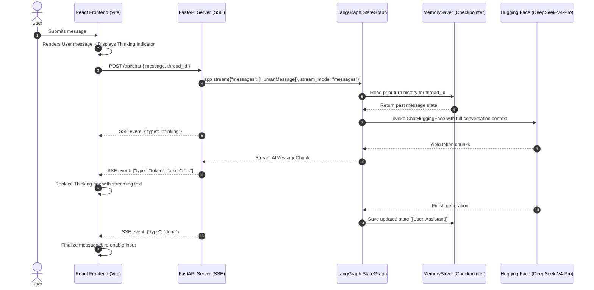

# 📘 Full-Stack LangGraph AI Chatbot: Complete Technical Documentation

> **A comprehensive guide to building, running, and understanding the production-grade chatbot powered by LangGraph, Hugging Face DeepSeek, FastAPI, and React.**

---

## 📑 Table of Contents
1. [Architecture & System Flow](#1-architecture--system-flow)
2. [LangGraph State Engine & Memory](#2-langgraph-state-engine--memory)
3. [Hugging Face LLM Integration](#3-hugging-face-llm-integration)
4. [Streaming & Thinking Mechanics](#4-streaming--thinking-mechanics)
5. [FastAPI Server & SSE Protocol](#5-fastapi-server--sse-protocol)
6. [React UI & Design System](#6-react-ui--design-system)
7. [API Specification](#7-api-specification)
8. [Troubleshooting & Common Pitfalls](#8-troubleshooting--common-pitfalls)
9. [How to Run](#9-how-to-run)

---

## 1. Architecture & System Flow

The application bridges a modern React web interface with a LangGraph state machine running DeepSeek via Hugging Face Inference Endpoints.



### Directory Structure
```
basic_chatbot/
├── backend/
│   ├── 35_basic_chatbot.py   # Standalone LangGraph StateGraph & CLI runner (Source of Truth)
│   └── server.py             # Lightweight FastAPI SSE server (imports graph from 35_basic_chatbot.py)
├── frontend/
│   ├── src/
│   │   ├── App.jsx           # Main React chatbot component
│   │   ├── index.css         # Glassmorphism dark mode design system
│   │   └── main.jsx          # React DOM entry
│   ├── index.html            # Google Fonts & SEO tags
│   ├── package.json          # Dependencies & scripts
│   └── vite.config.js        # Vite build configuration
├── DOCUMENTATION.md          # Technical documentation (this file)
└── README.md                 # Quick start guide
```

---

## 2. LangGraph State Engine & Memory

### 2.1 State Definition & Reducers
```python
from typing import Annotated, TypedDict
from langchain_core.messages import BaseMessage
from langgraph.graph import add_messages

class ChatState(TypedDict):
    """Core state: list of message objects with reducer"""
    messages: Annotated[list[BaseMessage], add_messages]
```

- **Why `Annotated[..., add_messages]`?**
  In standard Python dictionary updates, setting `{"messages": [new_msg]}` would overwrite the entire history.
  The `add_messages` reducer tells LangGraph: **append new messages to the existing list** rather than replacing them.

### 2.2 Node & Edge Structure
```python
from langgraph.graph import StateGraph, START, END

def chatbot_node(state: ChatState) -> dict:
    messages = state["messages"]
    response = llm.invoke(messages)
    return {"messages": [response]}

graph_builder = StateGraph(ChatState)
graph_builder.add_node("chatbot", chatbot_node)
graph_builder.add_edge(START, "chatbot")
graph_builder.add_edge("chatbot", END)
```

### 2.3 Persistence with `MemorySaver`
```python
from langgraph.checkpoint.memory import MemorySaver

checkpoint_saver = MemorySaver()
app = graph_builder.compile(checkpointer=checkpoint_saver)
```
- By attaching `MemorySaver()`, LangGraph tracks distinct conversation states partitioned by `thread_id`:
  ```python
  config = {"configurable": {"thread_id": "thread_1"}}
  app.stream(..., config=config)
  ```
- Subsequent calls with the same `thread_id` automatically retain the full dialogue history without re-sending old messages from the client.

---

## 3. Hugging Face LLM Integration

### 3.1 Model Initialization
```python
from langchain_huggingface import HuggingFaceEndpoint, ChatHuggingFace

MODEL_NAME = "deepseek-ai/DeepSeek-V4-Pro"

endpoint = HuggingFaceEndpoint(
    repo_id=MODEL_NAME,
    task="text-generation",
    max_new_tokens=512,
    temperature=0.7,
)
llm = ChatHuggingFace(llm=endpoint)
```

### 3.2 Why `ChatHuggingFace` is Necessary
Standard Hugging Face models expect raw strings or token IDs formatted using specific chat templates (e.g. `<｜User｜>...<｜Assistant｜>`).
`ChatHuggingFace`:
1. Reads the tokenizer's chat template directly from the model repository.
2. Converts LangChain objects (`HumanMessage`, `AIMessage`, `SystemMessage`) into the exact template formatting required.
3. Automatically authenticates using `HUGGINGFACEHUB_API_TOKEN` found in your `.env`.

---

## 4. Streaming & Thinking Mechanics

### 4.1 The "Repeated Input" Bug & Solution

#### The Problem:
When using `stream_mode="values"`, LangGraph outputs a snapshot of the entire state after each node:
- **Event 0 (Initial Input)**: `state["messages"]` = `[HumanMessage(content="hey")]`
- **Event 1 (After Chatbot)**: `state["messages"]` = `[HumanMessage(content="hey"), AIMessage(content="Hello!")]`

When reading `event["messages"][-1]`, Event 0 printed `"hey"` and Event 1 printed `"Hello!"`, resulting in:
```text
Bot: heyHello!
```

#### The Solution:
Switch to **`stream_mode="messages"`**:
```python
events = app.stream(
    {"messages": [HumanMessage(content=user_text)]},
    stream_mode="messages",
    config=config,
)

for msg_chunk, metadata in events:
    if metadata.get("langgraph_node") == "chatbot" and msg_chunk.content:
        # Only tokens generated by the LLM are streamed
        yield msg_chunk.content
```

### 4.2 Thinking Indicator
Before the first token arrives from the LLM endpoint (which can take 1–3 seconds due to inference queuing and reasoning):
1. **Backend**: Dispatches a `thinking` event as soon as the request arrives.
2. **Frontend**: Immediately displays the glowing thinking card (`DeepSeek is thinking...`).
3. **Transition**: As soon as the first token chunk arrives, the thinking card disappears and the streaming response begins.

---

## 5. FastAPI Server & SSE Protocol

### 5.1 Graph Reusability & Zero Duplication
Rather than rewriting the LangGraph state machine, nodes, model configuration, and checkpointer, `server.py` cleanly imports the compiled `app` directly from `35_basic_chatbot.py`:

```python
import importlib.util
from pathlib import Path

# Load compiled LangGraph app directly from the separate graph file
GRAPH_FILE = Path(__file__).resolve().parent / "35_basic_chatbot.py"
spec = importlib.util.spec_from_file_location("chatbot_graph", GRAPH_FILE)
graph_module = importlib.util.module_from_spec(spec)
spec.loader.exec_module(graph_module)

# Extract compiled graph & model info without duplicating state or node code
app_graph = graph_module.app
MODEL_NAME = getattr(graph_module.endpoint, "repo_id", "deepseek-ai/DeepSeek-V4-Pro")
```

**Benefits:**
- **Single Source of Truth**: Modifying nodes, prompts, or model parameters in [35_basic_chatbot.py](file:///c:/Coding/langChain/basic_chatbot/backend/35_basic_chatbot.py) automatically updates both the CLI runner and the FastAPI web server.
- **Clean Separation of Concerns**: `server.py` focuses purely on HTTP routing, CORS, and Server-Sent Events (SSE), while `35_basic_chatbot.py` encapsulates AI orchestration.

### 5.2 Server-Sent Events (SSE) Format
The endpoint `/api/chat` streams data compliant with the SSE standard:

| Event Type | Payload Example | Purpose |
| :--- | :--- | :--- |
| `thinking` | `{"type": "thinking", "status": "Thinking..."}` | Triggers the thinking shimmer in UI |
| `start` | `{"type": "start"}` | Signals transition from thinking to response |
| `token` | `{"type": "token", "token": "Hello"}` | Delivers individual text tokens |
| `done` | `{"type": "done", "full_response": "...", "thread_id": "..."}` | Signals end of generation |
| `error` | `{"type": "error", "error": "Details..."}` | Reports runtime or API errors |

### 5.2 CORS Configuration
The server enables Cross-Origin Resource Sharing (CORS) so Vite running on `http://localhost:5173` can communicate with FastAPI on `http://localhost:8000`:
```python
app.add_middleware(
    CORSMiddleware,
    allow_origins=["*"],
    allow_credentials=True,
    allow_methods=["*"],
    allow_headers=["*"],
)
```

---

## 6. React UI & Design System

### 6.1 State Hierarchy in `App.jsx`
- `messages`: Array of `{ id, role, content, timestamp }`.
- `isThinking`: Boolean controlling the animated thinking indicator.
- `isStreaming`: Boolean controlling typing cursor and disabling input while generating.
- `threadId`: Active conversation ID (e.g. `thread_1`).
- `threads`: List of saved session IDs.
- `serverOnline`: Live health-check status indicator (polls `/api/health` every 6 seconds).

### 6.2 Design System Tokens (`index.css`)
- **Theme**: Ultra-dark glassmorphism (`#080a0f` background, `#121826` card surfaces with `backdrop-filter: blur(16px)`).
- **Typography**: Google Fonts:
  - Header & Titles: `Outfit` (700/800 weight)
  - Body & Messages: `Inter` (400/500 weight)
  - Code & Metadata: `JetBrains Mono`
- **Accents**: Indigo (`#6366f1`) to Cyan (`#06b6d4`) gradient.

---

## 7. API Specification

### `GET /api/health`
Checks server and model status.
- **Response**:
  ```json
  {
    "status": "healthy",
    "model": "deepseek-ai/DeepSeek-V4-Pro",
    "default_thread": "default_thread"
  }
  ```

### `POST /api/chat`
Sends a user message and streams the assistant response.
- **Request Body**:
  ```json
  {
    "message": "What is the capital of India?",
    "thread_id": "thread_1"
  }
  ```
- **Response Header**: `Content-Type: text/event-stream`
- **Response Body**: Stream of `data: {"type": "...", ...}\n\n`

### `GET /api/history/{thread_id}`
Retrieves all stored messages from the checkpointer for a given session.
- **Response**:
  ```json
  {
    "thread_id": "thread_1",
    "messages": [
      {"role": "user", "content": "What is the capital of India?"},
      {"role": "assistant", "content": "The capital of India is New Delhi."}
    ]
  }
  ```

### `DELETE /api/history/{thread_id}`
Clears message history for the active thread.

---

## 8. Troubleshooting & Common Pitfalls

| Issue | Cause | Fix |
| :--- | :--- | :--- |
| `HuggingFaceHub API token missing` | `.env` not found or token variable unset | Ensure `.env` contains `HUGGINGFACEHUB_API_TOKEN=hf_...` in project root. |
| `Bot repeats user prompt` | `stream_mode="values"` outputting initial state | Use `stream_mode="messages"` and filter `metadata["langgraph_node"] == "chatbot"`. |
| `CORS error in browser` | FastAPI backend missing CORSMiddleware | `server.py` includes `allow_origins=["*"]`. |
| `KeyError: 'messages'` in State | Typo in state definition (`message` vs `messages`) | Use `messages: Annotated[list[BaseMessage], add_messages]`. |

---

## 9. How to Run

### Terminal 1: Backend
```powershell
cd c:\Coding\langChain
.\.venv\Scripts\Activate.ps1
python basic_chatbot/backend/server.py
```

### Terminal 2: Frontend
```powershell
cd c:\Coding\langChain\basic_chatbot\frontend
npm run dev
```

Visit **`http://localhost:5173/`** to interact with the chatbot.
